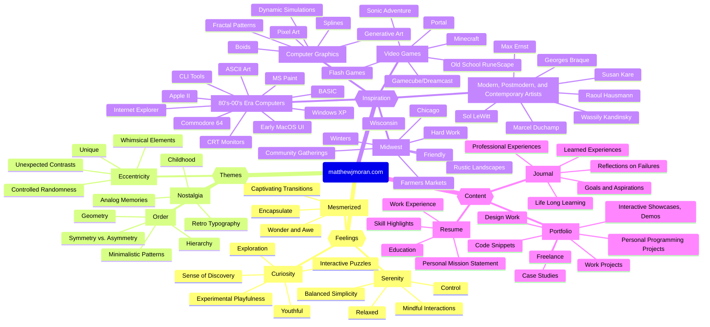

# Mindmap

A mindmap to help me brainstorm creative ideas for this project.

```mermaid
mindmap
  root(matthewjmoran.com)
    {{Feelings}}
      [Mesmerized]
        Encapsulate
        Wonder and Awe
        Captivating Transitions
      [Curiosity]
        Exploration
        Youthful
        Experimental Playfulness
        Sense of Discovery
        Interactive Puzzles
      [Serenity]
        Relaxed
        Control
        Balanced Simplicity
        Mindful Interactions
    {{Themes}}
      [Nostalgia]
        Childhood
        Analog Memories
        Retro Typography
      [Eccentricity]
        Controlled Randomness
        Unique
        Whimsical Elements
        Unexpected Contrasts
      [Order]
        Geometry
        Hierarchy
        Symmetry vs. Asymmetry
        Minimalistic Patterns
    {{Inspiration}}
      [Modern, Postmodern, and Contemporary Artists]
        Marcel Duchamp
        Wassily Kandinsky
        Sol LeWitt
        Georges Braque
        Raoul Hausmann
        Max Ernst
        Susan Kare
      [80's-00's Era Computers]
        Commodore 64
        Apple II
        Windows XP
        CLI Tools
        ASCII Art
        BASIC
        Internet Explorer
        MS Paint
        Early MacOS UI
        CRT Monitors
      [Video Games]
        Old School RuneScape
        Sonic Adventure
        Gamecube/Dreamcast
        Flash Games
        Minecraft
        Portal
      [Midwest]
        Chicago
        Wisconsin
        Winters
        Friendly
        Farmers Markets
        Hard Work
        Rustic Landscapes
        Community Gatherings
      [Computer Graphics]
        Boids
        Splines
        Pixel Art
        Generative Art
        Fractal Patterns
        Dynamic Simulations
    {{Content}}
      [Resume]
        Work Experience
        Education
        Skill Highlights
        Personal Mission Statement
      [Portfolio]
        Personal Programming Projects
        Work Projects
        Design Work
        Freelance
        Interactive Showcases, Demos
        Case Studies
        Code Snippets
      [Journal]
        Professional Experiences
        Learned Experiences
        Life Long Learning
        Reflections on Failures
        Goals and Aspirations
```
